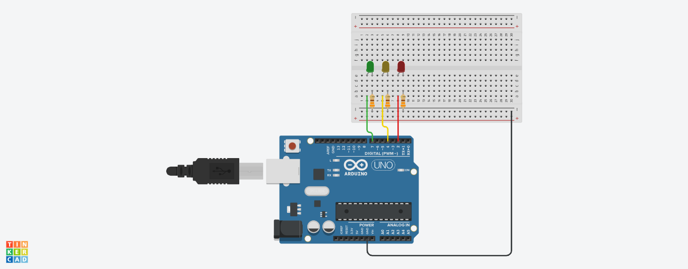
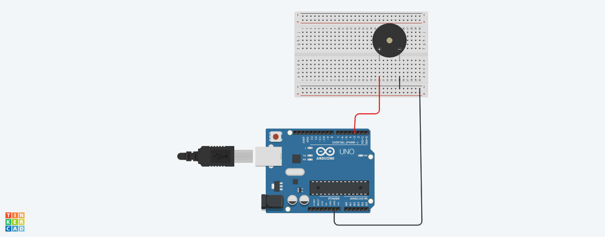

# Baby Projects Arduino

Some easy projects to start play with arduino and circuits.

## Projects:

> sketch-traffic-light
A simple project to simulate a traffic light

https://www.tinkercad.com/things/3KA9a5ax0Rb-traffic-light

> sketch-fire-siren
A simple project to simulate a fire siren

https://www.tinkercad.com/things/bh6y3hYrUk5-fire-siren
